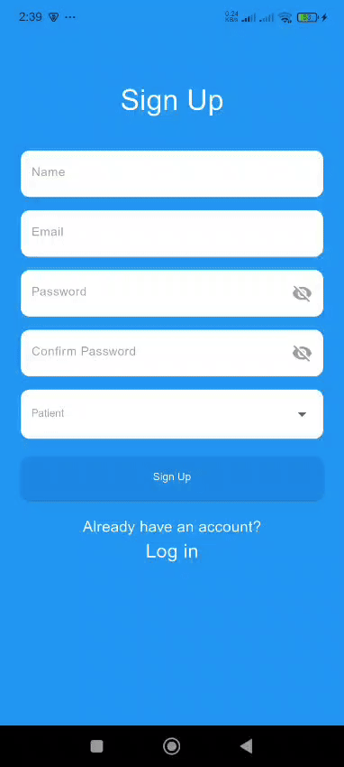

# 🏥 ICU Cardiac Monitoring System

A real-time cardiac monitoring and AI-powered risk prediction system for ICU patients.

---

## 🧭 Overview

The ICU Cardiac Monitoring System is a comprehensive mobile application designed to revolutionize patient care in intensive care units. By leveraging advanced machine learning models and real-time data streaming, the system enables healthcare professionals to monitor cardiac patients continuously and predict critical health risks before they escalate.

---

## ✨ Key Feature
   •	 Real-time Monitoring: Track vital signs including heart rate, blood pressure, SpO2, and ECG waveforms
   
   •	AI-Powered Predictions: Utilize XGBoost, CNN, and LSTM models to predict MI, heart failure, arrhythmia, and cardiac arrest risks
   
   •	Multi-Role Support: Separate interfaces for patients, nurses, and doctors with role-based access control
   
   •	Instant Alerts: Push notifications for critical risk levels to medical staff
   
   •	Comprehensive Analytics: Detailed patient profiles with medical history and risk trend visualization
   
---

## 🛠️ Tech Stack
   - Frontend
      •	Framework: Flutter 3.0+
     
      •	State Management:
          BLoC/Cubit for business logic
          Provider for theme management
     
      •	UI Libraries:
           Syncfusion Charts for data visualization
           Easy Localization (English/Arabic support)
     
   - Backend &  Database
      •	Firebase Authentication - User authentication with email/password
     
      •	Cloud Firestore - NoSQL database for real-time data
     
      •	Firebase Cloud Messaging (FCM) - Push notifications
     
      •	Firebase Storage - Profile images and medical documents
     
   - AI & Machine Learning
      •	ML Framework: Python (FastAPI/Flask backend)
     
      •	Models:
          XGBoost: MI and Heart Failure risk prediction
          CNN: ECG image analysis and arrhythmia detection
          LSTM: Time-series vital signs analysis for cardiac arrest prediction
          Ensemble Model: Aggregated risk scoring
     
      •	Image Processing: OpenCV, TensorFlow/PyTorch

---
## 🪄 App Preview



---

## 🚀 Getting Started

### 1. Clone the Repository
```bash
git clone https://github.com/soha131/Cardiac.git
```

### 2. Install Dependencies
```bash
flutter pub get
```

### 3. Run the App
```bash
flutter run
```

> Make sure your environment is set up with Flutter SDK.

---

## 🧩 Folder Structure

```

cardiac_app/
│
├── lib/
│   ├── auth/                    # Authentication screens
│   │   ├── login.dart
│   │   ├── sign_up.dart
│   │   └── forget_password.dart
│   │
│   ├── core/                    # Business logic & models
│   │   ├── ecg_cubit.dart
│   │   ├── ecg_state.dart
│   │   ├── risk_prediction_cubit.dart
│   │   ├── risk_prediction_state.dart
│   │   ├── risk_result_model.dart
│   │   └── patient_data_model.dart
│   │
│   ├── nurse/                   # Nurse-specific screens
│   │   ├── dashboard.dart
│   │   ├── NurseEntryScreen.dart
│   │   ├── ECGAnalyzeScreen.dart
│   │   └── NursePatientListScreen.dart
│   │
│   ├── patient/                 # Patient-specific screens
│   │   ├── basic-data.dart
│   │   └── patient_date.dart
│   │
│   ├── notification/            # Notification services
│   │   ├── notification.dart
│   │   └── local_notification_service.dart
│   │
│   ├── alert.dart               # Alert screen
│   ├── profile.dart             # User profile
│   ├── patient_detials.dart     # Patient details view
│   ├── theme_provider.dart      # Theme management
│   └── main.dart                # App entry point
│
├── assets/
│   ├── langs/                   # Translation files
│   │   ├── en.json
│   │   └── ar.json
│   └── firebase-service-account.json
│
├── pubspec.yaml                 # Dependencies
└── README.md

```


---
## 📅 Future Enhancements
   - 🌍 Add patient search functionality
   - 📴 Offline Mode - Local caching for uninterrupted access to medication data
   - 🤖 AI chatbot for preliminary diagnosis
   - 📄 Implement data export (PDF reports)

---
---

## 📸 Screenshots


---

## 🤝 Contributing

Contributions are welcome!  
Please open an issue or submit a pull request to help improve the project.

---

## 📄 License

This project is licensed under the **MIT License** — feel free to use and modify it.

---
